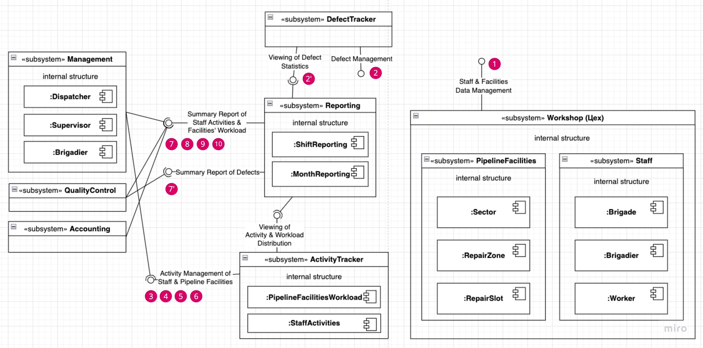

# Request for Proposals – система учёта дефектов

Homework Assignment on Requirements Analysis, Structure and Behavior Modeling of a Proposed Technical Requirement | HSE, 3rd year AMI (ПМИ), 2025

---

## Диаграмма классов

## Диаграмма компонентов

На диаграмме малиновыми кружками отмечены интерфейсные операции, которые закрывают соответствующий пункт секции с функциональностью в [файле](https://docs.google.com/document/d/1DsJBN70L_oUfK_k0qYacx3Z8KvUbKBktjegNype_mos/edit?tab=t.0#heading=h.5nsxhvy7qqg4) с требованиями.

### Аннотация:

1. **Workshop (Цех)**: отвечает за данные, связанные с персоналом и объектами конвейера.
1. **Reporting**: система для составления посменных и помесяцных отчетов о работе персонала, продвижению по выполнению задач, и информации по дефектам.
1. **DefectTracker**: менеждент (CRUD) дефектов.
1. **ActivityTracker**: менеждент рабочих задач и времени работников, а также информация по загруженности и работе объектов (участков, ремонтных зон и ремотных мест) конвейера.
1. **QualityControl**: Отдел контроля качества.
1. **Accounting**: Бухгалтерия.
1. **Management**: персонал, имеющий управленческие полномочия и отвечаюшие за менеджмент объектов конвейера.

## Диаграмма развёртывания