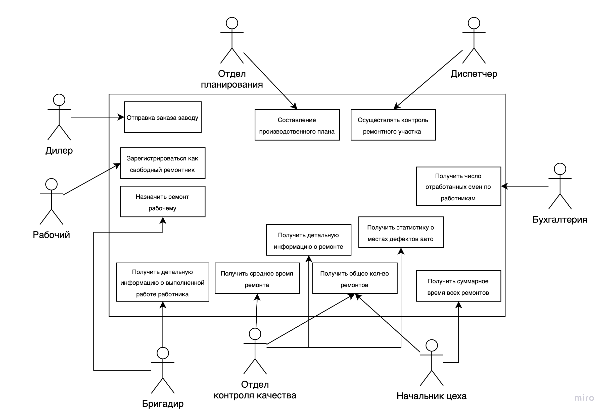
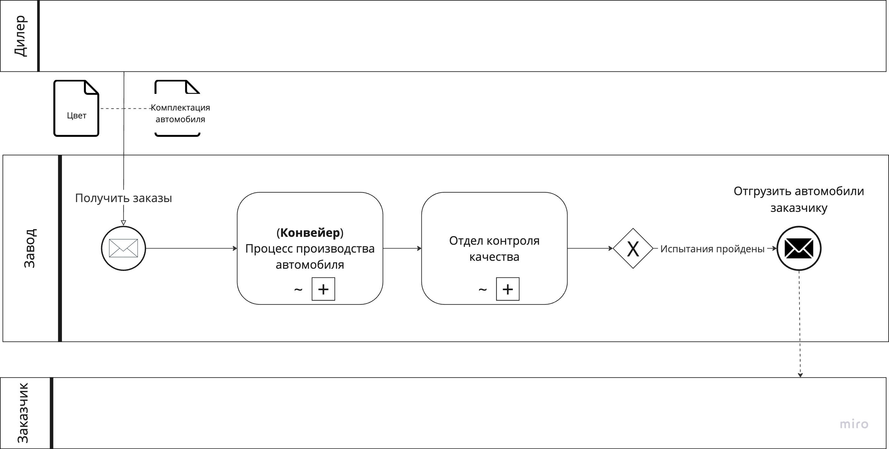
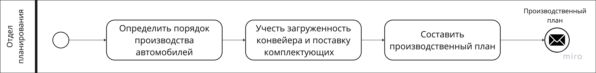
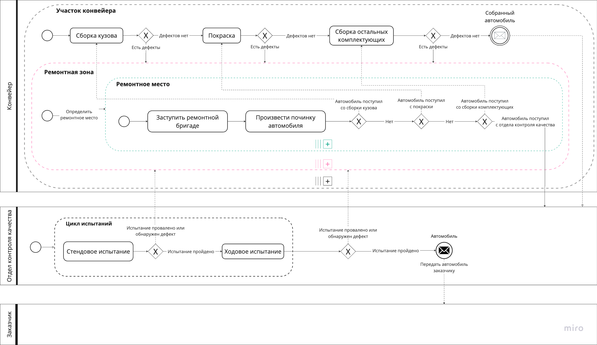

# Request for Proposals – система учёта дефектов

Homework Assignment on Requirements Analysis, Structure and Behavior Modeling of a Proposed Technical Requirement | HSE, 3rd year AMI (ПМИ), 2025

---

## Диаграмма Случаев Использования

Данная диаграмма описывает всех акторов системы и действия, которые они могу выполнять. Действия, разделяемые между несколькими акторами (такие как например, "Получить общее кол-во ремонтов") вынесены как отдельные пункты, остальные "сложные" действия вынесены как единичный box в пуле действий.

## Диаграмма Активностей

## BPMN-диаграмма

Данная диаграмма описывает взаимодействие завода и внешних сущностей, а именно Дилер и Заказчик. Процессы производства автомобиля и контроля качества скрыты и подробно описаны в третьей диаграмме.

Данная диаграмма описывает работу отдела планирования.

Данная диаграмма описывает процесс производства автомобиля и контроля качества, а также их взаимодействие между собой при обраружении дефектов или неудачного прохождения испытаний (в случае с отделом контроля качества).

